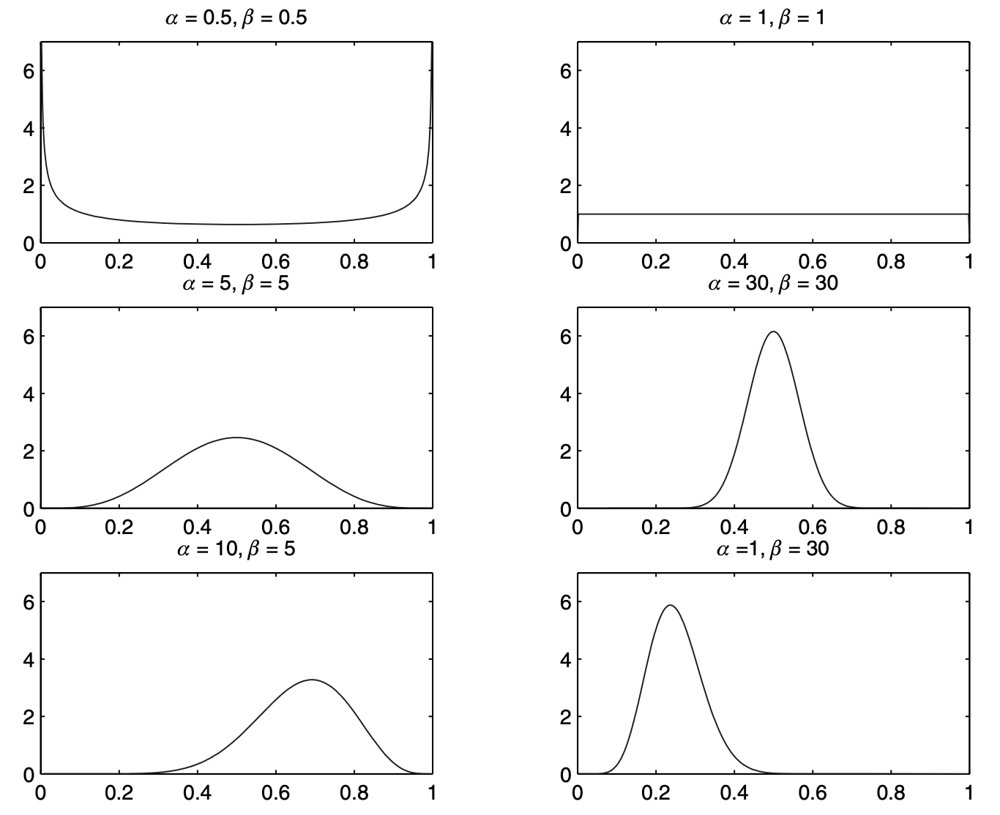
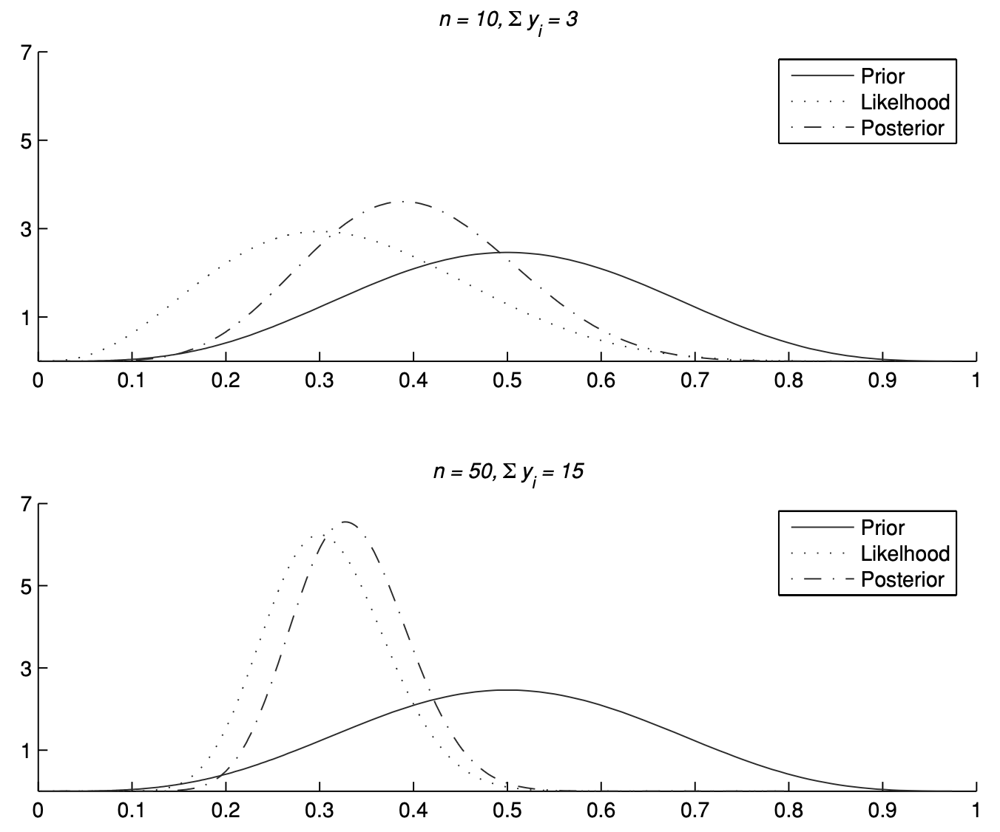

# Lecture 0: Basic Concepts of Probability and Inference

**Instructor:** Fei Tan

 @econdojo &nbsp;&nbsp;&nbsp;&nbsp;  @BusinessSchool101 &nbsp;&nbsp;&nbsp;&nbsp;  Saint Louis University

**Course:** Introduction to Bayesian Statistics  
**Date:** December 28, 2025

---

## What Is the Course About?

- Introduce Bayesian inferential methods & develop hands-on skills for Python data science

- **Why Bayesian paradigm?** Handle sophisticated models & uncertainty in decision making

- Main references
  - required: Greenberg (2008), "*Introduction to Bayesian Econometrics*"
  - optional: Geweke (2005), "*Contemporary Bayesian Econometrics and Statistics*"

- Homework production via [Visual Studio Code](https://code.visualstudio.com/)
  - LaTeX typesetting
  - Python programming

---

## The Road Ahead

1. [Probability](#frequentist-vs-bayesian)
2. [Prior, Likelihood, and Posterior](#prior-likelihood-and-posterior)

---

## Frequentist v.s. Bayesian

**Probability axioms**

$$\begin{align*}
&1.\ 0\leq\mathbb{P}(A)\leq 1\quad\text{for any event }A\\
&2.\ \mathbb{P}(A)=1\quad\text{if event }A\text{ represents logical truth}\\
&3.\ \mathbb{P}(A\cup B)=\mathbb{P}(A)+\mathbb{P}(B)\quad\text{for disjoint events }A\text{ and }B\\
&4.\ \mathbb{P}(A|B)=\mathbb{P}(A\cap B)/\mathbb{P}(B)\quad\text{(conditional probability)}
\end{align*}$$

- Satisfied by any assignment of probabilities
  - frequentists assign probabilities to events describing outcome of *repeated* experiment
  - Bayesians assign 'subjective' probabilities to uncertain events [de Finetti's (1990) coherency principle]

- How likely it rains tomorrow?

---

## Prior, Likelihood, and Posterior

**Bayes theorem**

$$\pi(\theta|y)=\frac{f(y|\theta)\pi(\theta)}{m(y)}\propto f(y|\theta)\pi(\theta)$$

- Bayesians treat **parameters** $\theta$ as random variables & **data** $y=[y_1,\ldots,y_n]'$ as given
  - start with **prior** density $\pi(\theta)$
  - update by **likelihood** function $f(y|\theta)$
  - **posterior** density $\pi(\theta|y)$ proportional to prior $\times$ likelihood
  - **marginal likelihood** $m(y)=\int f(y|\theta)\pi(\theta)d\theta$

---

## Coin-Tossing Example

- Likelihood function

    - one toss (Bernoulli): $\mathbb{P}(Y_i=1)=\theta=1-\mathbb{P}(Y_i=0)$

    $$f(y_i|\theta)=\theta^{y_i}(1-\theta)^{1-y_i}$$

    - $n$ independent tosses

    $$f(y_1,\ldots,y_n|\theta)=\theta^{\sum y_i}(1-\theta)^{n-\sum y_i}$$

- (Conjugate) beta prior: $\theta\sim\mathcal{B}(\alpha,\beta)$

    $$\pi(\theta)=\frac{\Gamma(\alpha+\beta)}{\Gamma(\alpha)\Gamma(\beta)}\theta^{\alpha-1}(1-\theta)^{\beta-1},\quad 0\leq\theta\leq1,\quad\alpha,\beta>0$$

- Beta posterior: $\theta | y\sim\mathcal{B}(\alpha+\sum y_i,\beta+n-\sum y_i)$

    $$\pi(\theta|y)\propto\theta^{\alpha+\sum y_i-1}(1-\theta)^{\beta+n-\sum y_i-1}$$

---

## Hyperparameters

- Shape of beta: $\mathbb{E}(\theta)=\frac{\alpha}{\alpha+\beta},\quad \mathbb{V}(\theta)=\frac{\alpha\beta}{(\alpha+\beta)^2(\alpha+\beta+1)}$

---

## Sample Size

- $\mathbb{E}(\theta|y)=\frac{\alpha+\beta}{\alpha+\beta+n}\mathbb{E}(\theta)+\frac{n}{\alpha+\beta+n}\bar{y}\to_{n\to\infty}\bar{y}\text{ (MLE)}$

---

## References

- de Finetti (1990), "Theory of Probability", John Wiley & Sons
