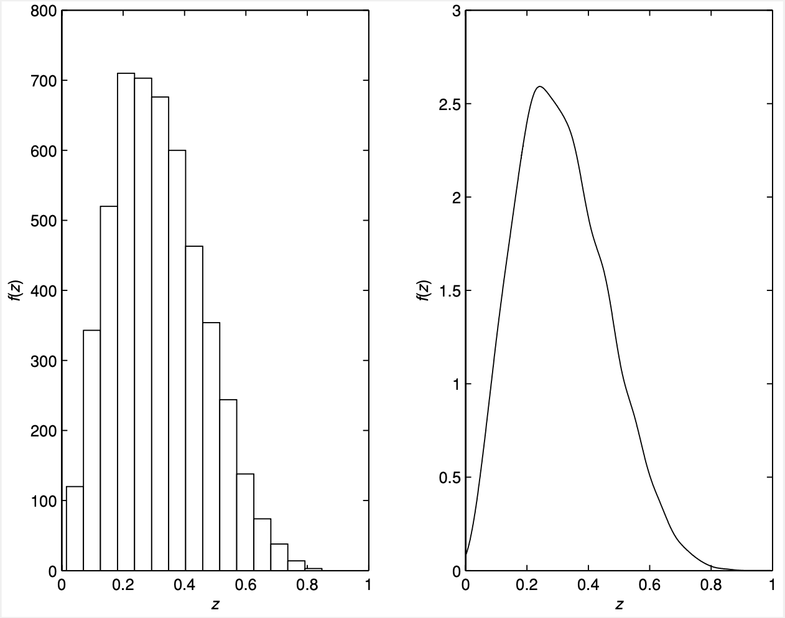
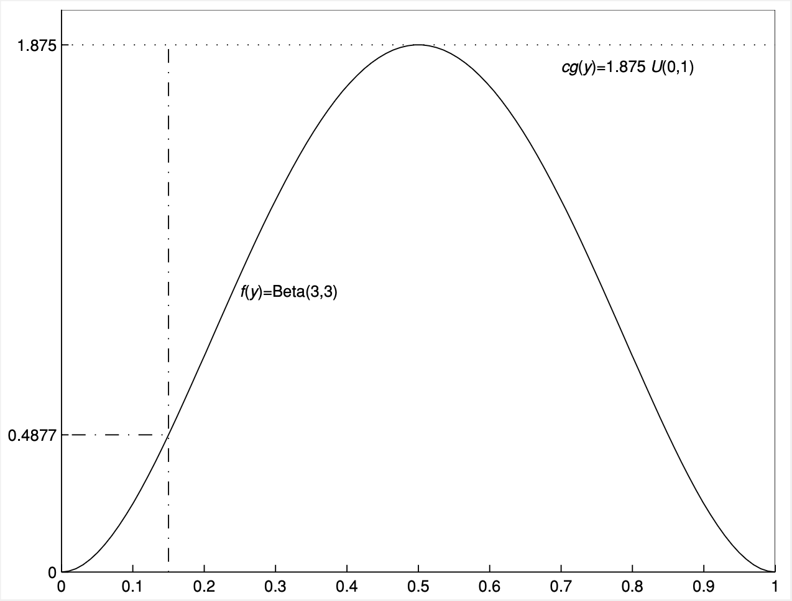

# Lecture 3: Classical Simulation

**Instructor:** Fei Tan

 @econdojo &nbsp;&nbsp;&nbsp;&nbsp;  @BusinessSchool101 &nbsp;&nbsp;&nbsp;&nbsp;  Saint Louis University

**Course:** Introduction to Bayesian Statistics  
**Date:** January 31, 2026

---

## The Road Ahead

1. [Preliminary](#using-simulated-output)
2. [Simulation Methods](#probability-integral-transform)

---

## Using Simulated Output

- Use $\{y^{(g)}\}_{g=1}^G\sim f(y)$ to investigate properties of $f(y)$, e.g.

  - approximate distribution of $X=h(Y)$, e.g. moments; numerical standard error (n.s.e.) = $\sqrt{\mathbb{V}(X)/G}$
  - 90% credible set: $0.05G$-th & $0.95G$-th ordered $y^{(g)}$
  - marginal (column) vs. joint (row) distribution

    $$\{\theta^{(g)}\}_{g=1}^G=
    \begin{bmatrix}
        \theta_1^{(1)} & \theta_2^{(1)} & \cdots & \theta_d^{(1)} \\
        \theta_1^{(2)} & \theta_2^{(2)} & \cdots & \theta_d^{(2)} \\
        \vdots & \vdots & \ddots & \vdots \\
        \theta_1^{(G)} & \theta_2^{(G)} & \cdots & \theta_d^{(G)}
    \end{bmatrix}$$

- Example: learn distribution $f(z)$ of $Z=XY$, $X\sim\mathcal{B}(3,3)$ and $Y\sim\mathcal{B}(5,3)$ are independent. Sample $\{x^{(g)}\}_{g=1}^G$, $\{y^{(g)}\}_{g=1}^G$, then $z^{(g)}=x^{(g)}y^{(g)}\sim f(z)$

---

## Using Simulated Output (Cont'd)



- Histogram (left) vs. kernel-smoothed density (right)

---

## Probability Integral Transform

**Algorithm 1**

<div class="equation-box">

$$\begin{align*}
&\text{Step 1: draw }u\sim\mathcal{U}(0,1)\\
&\text{Step 2: return }y=F^{-1}(u)\text{ as a draw from }f(y)
\end{align*}$$

</div>

- Represent $f(y)$ with $\mathbb{P}(Y\leq y)=F(y)$ by simulating *independent* samples from uniform distribution

  - useful for sampling from truncated $F(y)$: $\frac{F(y)-F(c_1)}{F(c_2)-F(c_1)}$ for $c_1\leq y\leq c_2$
  - not applicable for multivariate as $F$ is not injective

- Example: $f(y)=\frac{3}{8}y^2$ for $0\leq y\leq 2$ and $0$ otherwise

  - compute $F(y)=\frac{1}{8}y^3$ for $0\leq y\leq 2$
  - draw $u\sim\mathcal{U}(0,1)$ $\Rightarrow$ $y=2u^{\frac{1}{3}}\sim f(y)$

---

## Python Code

<div class="code-box">

```python
import numpy as np
import scipy.stats as stats
import matplotlib.pyplot as plt

# Generate random numbers
u = np.random.rand(10000)   # uniform
x = 2 * u**(1/3)   # probability integral transform

# Plot
plt.hist(x, bins=50, density=True, color="red", alpha=0.5)
plt.xlabel("x")
plt.ylabel("Probability Density")
plt.title("Histogram")
plt.show()
```

</div>

---

## Composition

**Algorithm 2**

<div class="equation-box">

$$\begin{align*}
&\text{Step 1: draw }y\sim h(y)\\
&\text{Step 2: draw }x\sim g(x|y)\text{ }\Rightarrow\text{ }x\sim f(x)=\int g(x|y)h(y)dy
\end{align*}$$

</div>

- Example: sample regression error $u_i|\sigma^2\sim t_{\nu}(0,\sigma^2)$

  $$f(u_i|\sigma^2)=\int\underbrace{g(u_i|\lambda_i,\sigma^2)}_{\mathcal{N}(u_i|0,\sigma^2/\lambda_i)}\underbrace{h(\lambda_i)}_{\mathcal{G}(\lambda_i|\nu/2,\nu/2)}d\lambda_i$$

  - conditional heteroskedasticity: $\mathbb{V}(u_i|\lambda_i,\sigma^2)=\lambda_i^{-1}\sigma^2$
  - unconditional homoskedasticity: $\mathbb{V}(u_i|\sigma^2)=\frac{\nu}{\nu-2}\sigma^2$

- Finite mixture distribution

  $$f(x)=\sum_{i=1}^Kp_if_i(x),\qquad\sum_{i=1}^Kp_i=1$$

---

## Python Code

<div class="code-box">

```python
def mix_normal(w, dist, n):
    """
    Try help(mix_normal) at runtime to display docstring
    """
    m = len(w)
    index = np.random.choice(m, size=n, p=w)   # categorical random variable
    sample = np.zeros(n)   # sample each component
    for i in range(m):
        k = np.where(index == i)
        sample[k] = dist[i].rvs(size=len(k[0]))
    return sample

# Sample mixture normal
w = [0.5, 0.5]
dist = [stats.norm(loc=-3, scale=1), stats.norm(loc=3, scale=1)]
sample = mix_normal(w, dist, 10000)
```

</div>

---

## Accept-Reject

**Algorithm 3**

<div class="equation-box">

$$\begin{align*}
&\text{Step 1: draw }y\sim g(y)\\
&\text{Step 2: draw }u\sim\mathcal{U}(0,1)\\
&\text{Step 3: accept }y\text{ as a draw from }f(y)\text{ if }u\leq\frac{f(y)}{cg(y)};\\
&\qquad\quad\text{ otherwise reject and return to step 1}
\end{align*}$$

</div>

- Represent target $f(y)$ by simulating *independent* samples from proposal $g(y)$ with $f(y)\leq cg(y)$ for some $c\geq 1$

  - $1/c$ = probability of acceptance $\Rightarrow$ choose small $c$
  - difficult to find proposal in multivariate case

- Example: sample $y\sim\mathcal{B}(3,3)$? Choose proposal $\mathcal{U}(0,1)$ and set $c=f(.5)/g(.5)=1.875$

---

## Accept-Reject (Cont'd)



- Efficient sampler tailors proposal to mimic target

---

## Python Code

<div class="code-box">

```python
def target(x):
    return stats.beta.pdf(x, a=3, b=3)

def proposal(x):
    return stats.uniform.pdf(x)

def accept_reject(target, proposal, c, n):
    sample = []
    while len(sample) < n:
        x = np.random.uniform(0, 1)
        u = np.random.uniform(0, 1)
        if u <= target(x) / (proposal(x)*c):
            sample.append(x)
    return np.array(sample)

# Sample beta
c = target(0.5) / proposal(0.5)
sample = accept_reject(target, proposal, c, 10000)
```

</div>

---

## Importance Sampling

**Algorithm 4**

<div class="equation-box">

$$\mathbb{E}[g(X)]\approx\frac{1}{G}\sum_{g=1}^Gg(x^{(g)})\underbrace{f(x^{(g)})/h(x^{(g)})}_{\text{importance weight}},\quad \{x^{(g)}\}_{g=1}^G\sim h(x)$$

</div>

- Monte Carlo integration: estimate $\mathbb{E}[g(X)]=\int g(x)f(x)dx$ by simulating *independent* samples from proposal $h(x)$

  - efficiency requires tailoring $h(x)$ to $f(x)$
  - why Gaussian is not suitable for $h(x)$? (thin tails)

- Example: $\mathbb{E}[(1+x^2)^{-1}]$, $x\sim\text{Exponential}(1)$ truncated to $[0,1]$

  - step 1: sample $\{x^{(g)}\}_{g=1}^G\sim\mathcal{B}(2,3)$
  - step 2: compute $\frac{1}{G}\sum_{g=1}^G\frac{1}{1+(x^{(g)})^2}\frac{e^{-x^{(g)}}}{1-e^{-1}}\frac{\mathbb{B}(2,3)}{x^{(g)}(1-(x^{(g)})^2)}$

---

## Python Code

<div class="code-box">

```python
def imp_sampler(target, proposal, sampler, n):
    sample = sampler(n)
    w = target(sample) / proposal(sample)
    return sample, w

# Monte Carlo integration
target = lambda x: stats.expon.pdf(x, scale=1)
proposal = lambda x: stats.beta.pdf(x, a=2, b=3)
sampler = lambda n: stats.beta.rvs(a=2, b=3, size=n)
n = 10000
sample, w = imp_sampler(target, proposal, sampler, n)
estimate = sum(1 / (1+sample**2) * w) / n
```

</div>

---

## Readings

- DeGroot & Schervish (2002), "Probability and Statistics," Addison-Wesley

- Robert & Casella (2004), "Monte Carlo Statistical Methods," Springer-Verlag
