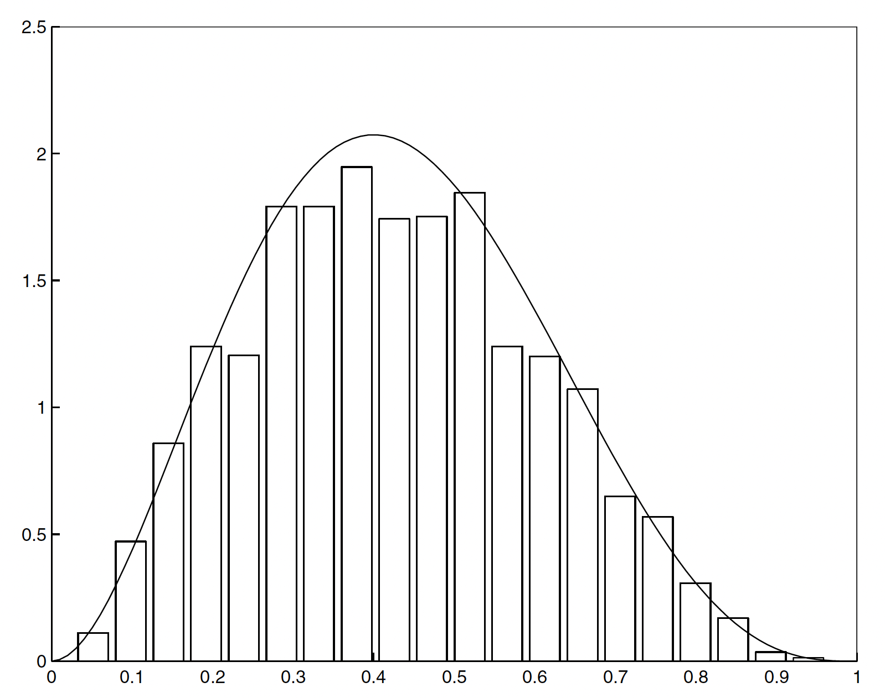
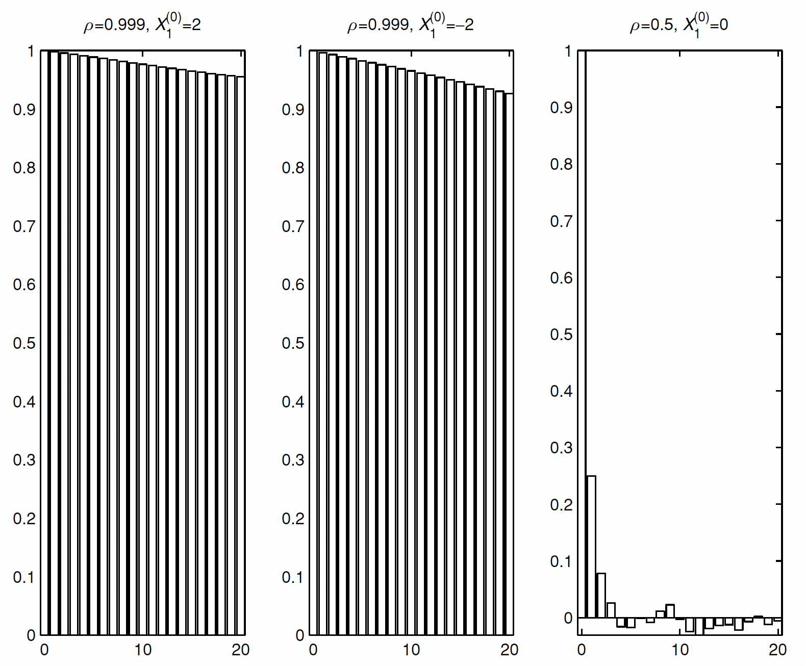

# Lecture 5: Simulation by MCMC Methods

**Instructor:** Fei Tan

 @econdojo &nbsp;&nbsp;&nbsp;&nbsp;  @BusinessSchool101 &nbsp;&nbsp;&nbsp;&nbsp;  Saint Louis University

**Course:** Introduction to Bayesian Statistics  
**Date:** January 31, 2026

---

## The Road Ahead

1. [Preliminary](#big-picture-of-mcmc)
2. [MCMC Methods](#gibbs-algorithm)

---

## Big Picture of MCMC

**Central equation**

<div class="equation-box">

$$\int_A\int_{\mathbb{R}^d}p(x,y)f(x)dxdy=\int_Af(y)dy,\quad\forall A\in\mathcal{B}(\mathbb{R}^d)$$

</div>

- What is Markov chain theory doing? Know transition kernel $p(\cdot,\cdot)$, find invariant distribution $f(\cdot)$

  $$\int_A\int_{\mathbb{R}^d}p(x,y)f^{(n-1)}(x)dxdy=\int_Af^{(n)}(y)dy\rightarrow\int_Af(y)dy$$

- Markov chain Monte Carlo (MCMC) is doing opposite: know $f(\cdot)$, find corresponding $p(\cdot,\cdot)$ such that

  $$f(x)p(x,y)=f(y)p(y,x)\quad\text{(reversibility)}$$

- MCMC methods greatly broaden Bayesian scope though at cost of simulating *dependent* samples

---

## Gibbs Algorithm

**Algorithm 1**

<div class="equation-box" style="text-align: left;">

1. Choose $x^{(0)}=(x_1^{(0)},\ldots,x_d^{(0)})$ and set $g=0$
2. Sample $x_i^{(g+1)}\sim f(x_i|x_{-i}^{(g)})$ for $i=1,\ldots,d$
3. Set $g=g+1$ and go to step 2

</div>

- Represent joint $f(x)$ by sampling conditional $f(x_i|x_{-i})$

  - discard burn-in phase, $\{x^{(g)}\}_{g=1}^G$ approximate $f(x)$
  - Rao-Blackwellization: $\hat{f}(x_i)=\frac{1}{G}\sum_{g=1}^Gf(x_i|x_{-i}^{(g)})$
  - rule of thumb: highly correlated $x_i$'s in one block
  - what if some $f(x_i|x_{-i})$ cannot be sampled directly?

- Exercise: prove for $d=2$ blocks, Gibbs kernel has invariant distribution $f(\cdot)$

  $$p(x,y)=f(y_1|x_2)f(y_2|y_1),\quad x=(x_1,x_2),\quad y=(y_1,y_2)$$

---

## Gibbs Algorithm (Cont'd)

- Consider Gaussian model

  - likelihood: $y_i\sim_{i.i.d.}\mathcal{N}(\mu,h^{-1})$, $i=1,\ldots,n$
  - conditionally conjugate prior: $\mu\sim\mathcal{N}(\mu_0,h_0^{-1})$, $h\sim\mathcal{G}(\frac{\alpha_0}{2},\frac{\delta_0}{2})$
  - conditional posteriors are of same family

- Gibbs algorithm

  - step 1: choose $\mu=\mu^{(0)}$, $h=h^{(0)}$, set $g=0$
  - step 2: sample recursively

    $$\begin{align*}
    \mu^{(g+1)} &\sim \mathcal{N}\left(\frac{h_0\mu_0+h^{(g)}n\bar{y}}{h_0+h^{(g)}n},(h_0+h^{(g)}n)^{-1}\right) \\
    h^{(g+1)} &\sim \mathcal{G}\left(\frac{\alpha_0+n}{2},\frac{\delta_0+\sum_{i=1}^n(y_i-\mu^{(g+1)})^2}{2}\right)
    \end{align*}$$

  - step 3: set $g=g+1$ and go to step 2

---

## Python Code

<div class="code-box">

```python
def gibbs_sampler(data, n, m0, h0, a0, d0):
    sample = np.zeros((n, 2))
    sample[0, 0] = m0
    sample[0, 1] = a0 / d0

    for i in range(1, n):
        m1 = (h0 * m0 + sample[i - 1, 1] * sum(data)) / (h0 + sample[i - 1, 1] * len(data))
        h1 = h0 + sample[i - 1, 1] * len(data)
        sample[i, 0] = stats.norm.rvs(size=1, loc=mu1, scale=1 / np.sqrt(h1))
        a1 = a0 + len(data)
        d1 = d0 + sum((data - sample[i, 0])**2)
        sample[i, 1] = stats.gamma.rvs(a1 / 2, size=1, scale=2 / d1)
    return sample
```

</div>

---

## Marginal Likelihood

**Marginal likelihood identity**

<div class="equation-box">

$$m(y)=\frac{f(y|\theta^*)\pi(\theta^*)}{\pi(\theta^*|y)},\qquad\forall\theta^*\in\Theta$$

</div>

- Chib (1995) computes $\pi(\theta^*|y)$ at high-density point $\theta^*$ from Gibbs output, e.g.

  $$\pi(\theta_1^*,\theta_2^*,\theta_3^*|y)={\color{red}\pi(\theta_1^*|y)}{\color{blue}\pi(\theta_2^*|\theta_1^*,y)}{\color{green}\pi(\theta_3^*|\theta_1^*,\theta_2^*,y)}$$

  - full run: ${\color{red}\hat{\pi}(\theta_1^*|y)}=\frac{1}{G}\sum_{g=1}^G\pi(\theta_1^*|\theta_2^{(g)},\theta_3^{(g)},y)$, where $\theta^{(g)}\sim\pi(\theta|y)$ $\Rightarrow$ $(\theta_2^{(g)},\theta_3^{(g)})\sim\pi(\theta_2,\theta_3|y)$
  - reduced run: ${\color{blue}\hat{\pi}(\theta_2^*|\theta_1^*,y)}=\frac{1}{G}\sum_{g=1}^G\pi(\theta_2^*|\theta_1^*,\theta_3^{(g)},y)$, where $\theta_{-1}^{(g)}\sim\pi(\theta_{-1}|\theta_1^*,y)$ $\Rightarrow$ $\theta_2^{(g)}\sim\pi(\theta_2|\theta_1^*,y)$, $\theta_3^{(g)}\sim\pi(\theta_3|\theta_1^*,y)$
  - ${\color{green}\pi(\theta_3^*|\theta_1^*,\theta_2^*,y)}$ can be evaluated directly

---

## Python Code

<div class="code-box">

```python
def marg_lik(data, sample, m, h, m0, h0, a0, d0):
    m1 = (h0 * m0 + sample[:, 1] * sum(data)) / (h0 + sample[:, 1] * len(data))
    h1 = h0 + sample[:, 1] * len(data)
    log_post1 = np.log(np.mean(stats.norm.pdf(m, loc=m1, scale=1 / np.sqrt(h1))))

    a1 = a0 + len(data)
    d1 = d0 + sum((data - m)**2)
    log_post2 = stats.gamma.logpdf(h, a1 / 2, scale=2 / d1)

    log_lik = sum(stats.norm.logpdf(data, loc=m, scale=1 / np.sqrt(h)))
    log_prior = stats.norm.logpdf(m, loc=m0, scale=1 / np.sqrt(h0)) + stats.gamma.logpdf(h, a0 / 2, scale=2 / d0)
    return log_lik + log_prior - log_post1 - log_post2
```

</div>

---

## Metropolis-Hastings Algorithm

**Algorithm 2**

<div class="equation-box" style="text-align: left;">

1. Choose $x^{(0)}$ and set $g=0$
2. Sample proposal $y\sim q(x^{(g)},y)$, $u\sim\mathcal{U}(0,1)$. If
   $$u\leq\alpha(x^{(g)},y)=
   \begin{cases} 
   \min\left\{\frac{f(y)q(y,x^{(g)})}{f(x^{(g)})q(x^{(g)},y)},1\right\}, & \text{if $f(x^{(g)})q(x^{(g)},y)$}>0 \\
   0, & \text{otherwise}
   \end{cases}$$
   set $x^{(g+1)}=y$; otherwise, set $x^{(g+1)}=x^{(g)}$
3. Set $g=g+1$ and go to step 2

</div>

- Chib & Greenberg (1995): MH kernel $p(x,y)=\alpha(x,y)q(x,y)$ is reversible and has invariant distribution $f(\cdot)$

  - choice of proposal: random-walk/independence, but good mixing requires 'tailoring' proposal to target
  - more generally, MH-within-Gibbs algorithm

---

## MH Algorithm (Cont'd)



- Target: $\mathcal{B}(3,4)$; proposal: $\mathcal{U}(0,1)$; $G=5,000$ draws

---

## Python Code

<div class="code-box">

```python
def mh_sampler(n):
    sample = np.zeros(n)
    sample[0] = 0.5
    rej = 0

    for i in range(1, n):
        x = np.random.rand(1)
        alpha = min(1, stats.beta.pdf(x, 3, 4) / stats.beta.pdf(sample[i - 1], 3, 4))
        if np.random.rand(1) > alpha:   # reject
            rej += 1
            sample[i] = sample[i - 1]
        else:   # accept
            sample[i] = x

    return sample, rej
```

</div>

---

## Marginal Likelihood Revisited

**Marginal likelihood identity**

<div class="equation-box">

$$m(y)=\frac{f(y|\theta^*)\pi(\theta^*)}{\pi(\theta^*|y)},\qquad\forall\theta^*\in\Theta$$

</div>

- Chib and Jeliazkov (2001) compute $\pi(\theta^*|y)$ at high-density point $\theta^*$ from MH output, e.g. for one-block case

  $$\alpha(\theta,\theta^*|y)q(\theta,\theta^*|y)\pi(\theta|y)=\alpha(\theta^*,\theta|y)q(\theta^*,\theta|y)\pi(\theta^*|y)$$

  from which

  $$\pi(\theta^*|y)=\frac{\color{red}\int\alpha(\theta,\theta^*|y)q(\theta,\theta^*|y)\pi(\theta|y)d\theta}{\color{blue}\int\alpha(\theta^*,\theta|y)q(\theta^*,\theta|y)d\theta}$$

  - numerator: ${\color{red}\frac{1}{G}\sum_{g=1}^G\alpha(\theta^{(g)},\theta^*|y)q(\theta^{(g)},\theta^*|y)}$, $\theta^{(g)}\sim\pi(\theta|y)$
  - denominator: ${\color{blue}\frac{1}{G}\sum_{g=1}^G\alpha(\theta^*,\theta^{(g)}|y)}$, $\theta^{(g)}\sim q(\theta^*,\theta|y)$

---

## Python Code

<div class="code-box">

```python
def post_ord(prop, sample, x):
    n = len(sample)
    num = np.zeros(n)
    den = np.zeros(n)

    for i in range(n):
        num[i] = min(1, stats.beta.pdf(x, 3, 4) / stats.beta.pdf(sample[i], 3, 4))
        den[i] = min(1, stats.beta.pdf(prop[i], 3, 4) / stats.beta.pdf(x, 3, 4))

    return np.log(np.mean(num)) - np.log(np.mean(den))
```

</div>

---

## Convergence

- Measures of convergence

  - numerical standard error (n.s.e.)

    $$\text{n.s.e.}=\frac{1}{b(b-1)}\sum_{i=1}^b(m_i-\bar{m})^2$$

    where $m_i$ = batch $i$ mean, $\bar{m}$ = overall mean
  - autocorrelation function $\rho(\cdot)$ and inefficiency factor

    $$\frac{\text{numerical variance of MCMC draws}}{\text{numerical variance of i.i.d. draws}}\approx 1+2\sum_{j=1}^Kw(j/K)\rho(j)$$

    $\rho(\cdot)$ is truncated by $K$ and weighted by Parzen kernel $w(\cdot)$

- Judging convergence is as much art as science: 'low' serial correlation and inefficiency factor

---

## Convergence (Cont'd)



- Gibbs sampler for $\mathcal{N}(0,\Sigma)$, $\Sigma=[1,\rho;\rho,1]$

---

## Readings

- Chib (1995), "Marginal Likelihood from the Gibbs Output," *Journal of the American Statistical Association*

- Chib & Greenberg (1995), "Understanding the Metropolis-Hastings Algorithm," *The American Statistician*

- Chib & Jeliazkov (2001), "Marginal Likelihood from the Metropolis-Hastings Output," *Journal of the American Statistical Association*
