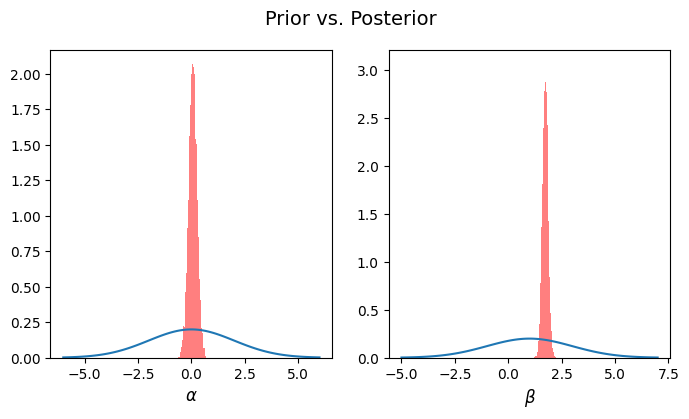
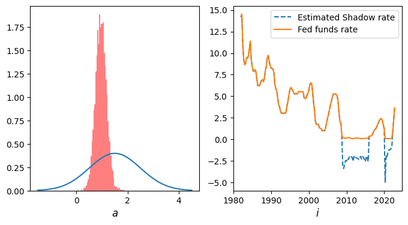
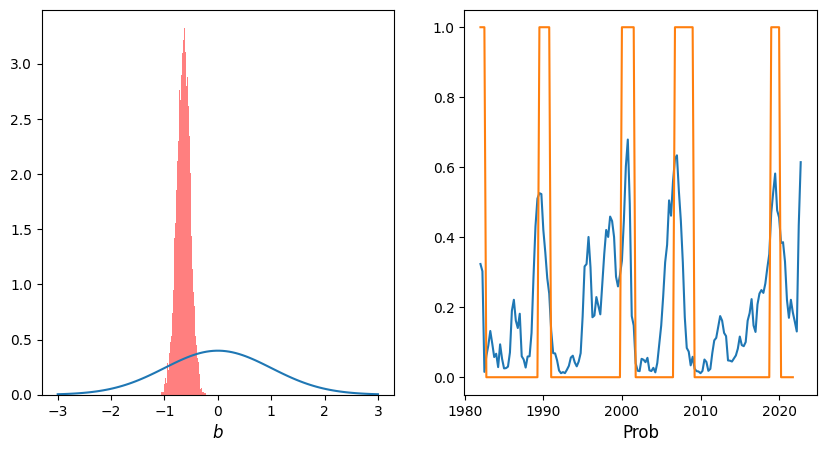

# Lecture 6: Linear Regression and Extensions

**Instructor:** Fei Tan

 @econdojo &nbsp;&nbsp;&nbsp;&nbsp;  @BusinessSchool101 &nbsp;&nbsp;&nbsp;&nbsp;  Saint Louis University

**Course:** Introduction to Bayesian Statistics  
**Date:** January 31, 2026

---

## Extending Linear Regressions (LR)

**General setup**

<div class="equation-box">

$$\begin{align*}
y_i^* &= x_i'\beta+u_i,\qquad u_i|x_i\sim_{i.i.d.}t_{\nu}(0,\sigma^2) \\
\mathbb{E}[y_i|x_i] &= G(x_i'\beta),\qquad i=1,\ldots,n
\end{align*}$$

</div>

- Choice of link function $G(\cdot)$

  - standard LR

    $$G(x_i'\beta)=x_i'\beta\quad\Rightarrow\quad y_i=y_i^*$$

  - tobit censored LR ($\nu=\infty$; $\mathcal{N}(0,1)$ p.d.f. $\phi$, c.d.f. $\Phi$)

    $$G(x_i'\beta)=x_i'\beta+\frac{\phi(-x_i'\beta/\sigma)}{1-\Phi(-x_i'\beta/\sigma)}\sigma\quad\Rightarrow\quad y_i=\max\{y_i^*,0\}$$

  - binary probit LR ($\nu=\infty$; $\sigma^2=1$)

    $$G(x_i'\beta)=\Phi(x_i'\beta)\quad\Rightarrow\quad y_i=1\{y_i^*>0\}$$

---

## The Road Ahead

1. [Continuous Dependent Variables](#lr-with-gaussian-errors)
2. [Limited Dependent Variables](#tobit-censored-lr)

---

## LR with Gaussian Errors

- Conditionally conjugate prior

  $$\beta\sim\mathcal{N}(\beta_0,B_0),\qquad\sigma^2\sim\mathcal{IG}\text{-}2(\alpha_0/2,\delta_0/2)$$

- Gibbs algorithm

  - step 1: choose $\beta=\beta^{(0)}$, $\sigma^2=\sigma^{2(0)}$, set $g=0$
  - step 2: sample recursively

    $$\beta^{(g)}\sim\mathcal{N}(\beta_1^{(g+1)},B_1^{(g+1)}),\qquad\sigma^{2(g+1)}\sim\mathcal{IG}\text{-}2(\alpha_1/2,\delta_1^{(g+1)}/2)$$

    $$\begin{align*}
    \text{where}\quad B_1^{(g+1)}&=(\sigma^{-2(g)}X'X+B_0^{-1})^{-1} \\
    \beta_1^{(g+1)} &= B_1^{(g+1)}(\sigma^{-2(g)}X'y+B_0^{-1}\beta_0) \\
    \alpha_1 &= \alpha_0+n \\
    \delta_1^{(g+1)} &= \delta_0+(y-X\beta^{(g+1)})'(y-X\beta^{(g+1)})
    \end{align*}$$

  - step 3: set $g=g+1$ and go to step 2

---

## LR with Student-$t$ Errors

- Conditional likelihood [see also Geweke (1993)]

  $$f(y_i|\beta,\sigma^2,\lambda_i)=\mathcal{N}(x_i'\beta,\lambda_i^{-1}\sigma^2),\quad\lambda_i\sim\mathcal{G}(\nu/2,\nu/2)\text{ (latent)}$$

- Gibbs sampler for $\pi(\beta,\sigma^2,\lambda|y)$

  $$\begin{align*}
  \beta|y,\lambda,\sigma^2 &\sim \mathcal{N}(\beta_1,B_1) \\
  \sigma^2|y,\beta,\lambda &\sim \mathcal{IG}\text{-}2(\alpha_1/2,\delta_1/2) \\
  \lambda_i|y,\beta,\sigma^2 &\sim \mathcal{G}(\nu_1/2,\nu_{2i}/2),\qquad i=1,\ldots,n
  \end{align*}$$

  where $\Lambda=\text{diag}(\lambda_i)$ and

  $$\begin{align*}
  B_1 &=(\sigma^{-2}X'\Lambda X+B_0^{-1})^{-1} \\
  \beta_1 &= B_1(\sigma^{-2}X'\Lambda y+B_0^{-1}\beta_0) \\
  \alpha_1 &= \alpha_0+n \\
  \delta_1 &= \delta_0+(y-X\beta)'\Lambda(y-X\beta) \\
  \nu_1 &= \nu+1 \\
  \nu_{2i} &= \nu+\sigma^{-2}(y_i-x_i'\beta)^2
  \end{align*}$$

---

## Python Code

<div class="code-box">

```python
def full_run(y, x, n, b0, B0, a0, d0, n0):
    for i in range(1, n):
        # Sample beta
        B1 = inv(x.T @ diag(s['lam'][i - 1, :]) @ x / s['sig2'][i - 1] + inv(B0))
        b1 = B1 @ (x.T @ diag(s['lam'][i - 1, :]) @ y / s['sig2'][i - 1] + inv(B0) @ b0)
        s['beta'][i, :] = multivariate_normal.rvs(size=1, mean=b1, cov=B1)
        # Sample sigma^2
        e = y - x @ s['beta'][i, :]
        d1 = d0 + e.T @ diag(s['lam'][i - 1, :]) @ e
        s['sig2'][i] = invgamma.rvs((a0 + len(y)) / 2, size=1, scale=d1 / 2)
        # Sample lambda
        for j in range(len(y)):
            n2 = n0 + e[j]**2 / s['sig2'][i]
            s['lam'][i, j] = gamma.rvs((nu0 + 1) / 2, size=1, scale=2 / n2)
    return s
```

</div>

---

## Marginal Likelihood

**Chib method**

<div class="equation-box">

$$m(y)=\frac{\prod_{i=1}^nt_{\nu}(x_i'\beta^*,\sigma^{2*})\pi(\beta^*)\pi(\sigma^{2*})}{\pi(\beta^*,\sigma^{2*}|y)},\quad\forall\theta^*=(\beta^*,\sigma^{2*})\in\Theta$$

</div>

- Compute $\pi(\beta^*,\sigma^{2*}|y)$ (not involving $\lambda$) at high-density point $\theta^*$ from Gibbs output

  $$\pi(\beta^*,\sigma^{2*}|y)={\color{red}\pi(\beta^*|y)}{\color{blue}\pi(\sigma^{2*}|\beta^*,y)}$$

  - full run: ${\color{red}\hat{\pi}(\beta^*|y)}=\frac{1}{G}\sum_{g=1}^G\pi(\beta^*|\sigma^{2(g)},\lambda^{(g)},y)$, where $(\theta^{(g)},\lambda^{(g)})\sim\pi(\theta,\lambda|y)$
  - reduced run: ${\color{blue}\hat{\pi}(\sigma^{2*}|\beta^*,y)}=\frac{1}{G}\sum_{g=1}^G\pi(\sigma^{2*}|\beta^*,\lambda^{(g)},y)$, where $(\sigma^{2(g)},\lambda^{(g)})\sim\pi(\sigma^2,\lambda|\beta^*,y)$

---

## Python Code

<div class="code-box">

```python
def marg_lik(y, x, s1, s2, beta, sig2, b0, B0, a0, d0, n0):
    # s1, s2 samples from full & reduced runs
    for i in range(n):
        B1 = inv(x.T @ diag(s1['lam'][i, :]) @ x / s1['sig2'][i] + inv(B0))
        b1 = B1 @ (x.T @ diag(s1['lam'][i, :]) @ y / s1['sig2'][i] + inv(B0) @ b0)
        pd1[i] = multivariate_normal.pdf(beta, mean=b1, cov=B1)
        e = y - x @ beta
        d1 = d0 + e.T @ diag(s2['lam'][i, :]) @ e
        pd2[i] = invgamma.pdf(sig2, a1 / 2, scale=d1 / 2)
    ll = sum(t.logpdf(e, n0, scale=sqrt(sig2)))
    lp = multivariate_normal.logpdf(beta, mean=b0, cov=B0) + invgamma.logpdf(sig2, a0 / 2, scale=d0 / 2)
    return ll + lp - log(mean(pd1)) - log(mean(pd2))
```

</div>

---

## Application: Stock Return Risk



- $R_{\text{TSLA}}=\alpha+\beta R_{\text{SPY}}+u$, 02/25/2022 - 02/25/2023
- $\alpha\sim\mathcal{N}(0,2^2)$, $\beta\sim\mathcal{N}(1,2^2)$, $\sigma^2\sim\mathcal{IG}\text{-}2(\frac{5}{2},\frac{5}{2})$
- $\ln m(y) = -661.0163$ for $\nu=5$

---

## Tobit Censored LR

**Model**

<div class="equation-box">

$$\begin{align*}
y_i^* &= x_i'\beta+u_i,\qquad u_i|x_i\sim_{i.i.d.}\mathcal{N}(0,\sigma^2) \\
y_i &= \max\{y_i^*,0\},\qquad i=1,\ldots,n
\end{align*}$$

</div>

- Chib (1992) introduces latent variables $z$ for censored observations and Gibbs sampler for $\pi(\beta,\sigma^2,z|y)$

  - conditionally conjugate prior for $(\beta,\sigma^2)$ as before
  - sample $\beta|y_z,\sigma^2 \sim \mathcal{N}(\beta_1,B_1)$, where $y_z$ replaces $y_i=0$ by $z_i<0$
  - sample $\sigma^2|y_z,\beta \sim \mathcal{IG}\text{-}2(\alpha_1/2,\delta_1/2)$
  - sample $z_i|y,\beta,\sigma^2\sim\mathcal{TN}_{(-\infty,0)}(x_i'\beta,\sigma^2)$ (truncated normal)
  - exercise: Student-$t$ version

- Data augmentation technique [Tanner & Wong (1987)]

---

## Python Code

<div class="code-box">

```python
def tobit(y, x, n, b0, B0, a0, d0, c):
    ind = where(y < c)[0]
    for i in range(1, n):
        y[ind] = s['z'][i - 1, :]
        B1 = inv(x.T @ x / s['sig2'][i - 1] + inv(B0))
        b1 = B1 @ (x.T @ y / s['sig2'][i - 1] + inv(B0) @ b0)
        s['beta'][i, :] = multivariate_normal.rvs(size=1, mean=b1, cov=B1)
        m = x @ s['beta'][i, :]
        d1 = d0 + (y - m).T @ (y - m)
        s['sig2'][i] = invgamma.rvs((a0 + len(y)) / 2, size=1, scale=d1 / 2)
        for j in range(len(y)):
            s['z'][i, j] = truncnorm.rvs(-1e3, (c - m[ind[j]]) / sqrt(s['sig2'][i]), loc=m[ind[j]], scale=sqrt(s['sig2'][i]), size=1)
    return s
```

</div>

---

## Application: Taylor Rule with ZLB



- $i=i^*+a(\pi-\pi^*)+b(y-y^*)+u$, 1982:Q1 - 2022:Q4
- $i^*\sim\mathcal{N}(4,1)$, $a\sim\mathcal{N}(1.5,1)$, $b\sim\mathcal{N}(0.5,1)$, $\sigma^2\sim\mathcal{IG}\text{-}2(\frac{5}{2},\frac{5}{2})$
- Effective lower bound = 0.25%

---

## Binary Probit LR

**Model**

<div class="equation-box">

$$\begin{align*}
y_i^* &= x_i'\beta+u_i,\qquad u_i|x_i\sim_{i.i.d.}\mathcal{N}(0,1) \\
y_i&=1\{y_i^*>0\},\qquad i=1,\ldots,n
\end{align*}$$

</div>

- Albert and Chib (1993) introduce latent variables $z=y^*$ and Gibbs sampler for $\pi(\beta,z|y)$

  - $\beta\sim\mathcal{N}(\beta_0,B_0)$ as before; $\sigma^2=1$ for identification
  - sample $\beta|z \sim \mathcal{N}(\beta_1,B_1)$ ($B_1$ not updated)
  - sample $z_i|y,\beta\sim\mathcal{TN}_{(-\infty,0]}(x_i'\beta,1)$ if $y_i=0$ or $\mathcal{TN}_{(0,\infty)}(x_i'\beta,1)$ if $y_i=1$
  - exercise: Student-$t$ version

- Binary logit LR: $u_i|x_i\sim_{i.i.d.}\mathcal{L}(0,1)$ (logistic distribution)

---

## Python Code

<div class="code-box">

```python
def probit(y, x, n, b0, B0):
    for i in range(1, n):
        b1 = B1 @ (x.T @ s['z'][i - 1, :] + inv(B0) @ b0)
        s['beta'][i, :] = multivariate_normal.rvs(size=1, mean=b1, cov=B1)
        m = x @ s['beta'][i, :]
        for j in range(len(y)):
            if y[j] == 0:
                s['z'][i, j] = truncnorm.rvs(-1e3, -m[j], loc=m[j], scale=1, size=1)
            else:
                s['z'][i, j] = truncnorm.rvs(-m[j], 1e3, loc=m[j], scale=1, size=1)
    return s
```

</div>

---

## Application: Forecasting Recession



- $\mathbb{P}(\text{NBER}_{t+1,t+4}=1)=\Phi(a+b\times\text{Spread}_t)$, 1982:Q1 - 2022:Q4
- $a\sim\mathcal{N}(0,1)$, $b\sim\mathcal{N}(0,1)$

---

## Readings

- Albert & Chib (1993), "Bayesian Analysis of Binary and Polychotomous Response Data," *Journal of the American Statistical Association*

- Chib (1992), "Bayes Inference in the Tobit Censored Regression Model," *Journal of Econometrics*

- Geweke (1993), "Bayesian Treatment of the Independent Student-$t$ Linear Model," *Journal of Applied Econometrics*

- Tanner & Wong (1987), "The Calculation of Posterior Distributions by Data Augmentation (with Discussion)," *Journal of the American Statistical Association*
