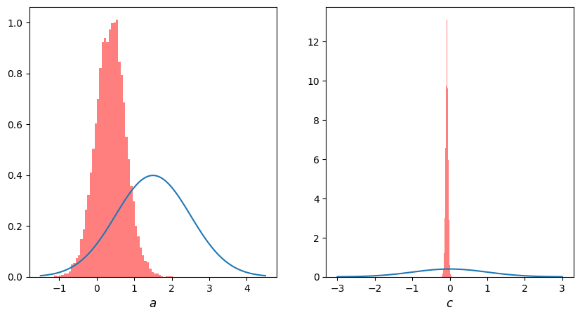
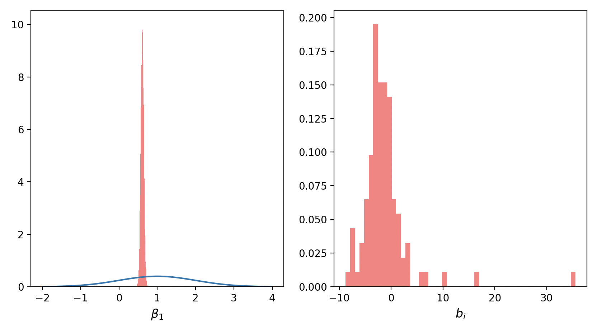

# Lecture 7: Multivariate Responses

**Instructor:** Fei Tan

 @econdojo &nbsp;&nbsp;&nbsp;&nbsp;  @BusinessSchool101 &nbsp;&nbsp;&nbsp;&nbsp;  Saint Louis University

**Course:** Introduction to Bayesian Statistics  
**Date:** January 31, 2026

---

## System of Equations

**General setup**

<div class="equation-box">

$$y_{ij} = x_{ij}'\beta_i+u_{ij},\quad i=1,\ldots,n,\quad j=1,\ldots,m$$

</div>

- Two important examples

  - Zellner's (1962) seemingly unrelated regression (SUR): small # of units $n$, large # of observations $m$ (e.g. time)
  - panel (longitudinal) data model: large # of units $n$, small # of periods $m=T$

---

## The Road Ahead

1. [SUR Model](#sur-model)
2. [Panel Data Model](#panel-data-model)

---

## SUR Model

**Setup**

<div class="equation-box">

$$\begin{bmatrix}
y_{1j} \\
\vdots \\
y_{nj}
\end{bmatrix}=
\begin{bmatrix}
x_{1j}' & \cdots & 0 \\
\vdots & \ddots & \vdots \\
0 & \cdots & x_{nj}'
\end{bmatrix}
\begin{bmatrix}
\beta_{1} \\
\vdots \\
\beta_{n}
\end{bmatrix}+
\begin{bmatrix}
u_{1j} \\
\vdots \\
u_{nj}
\end{bmatrix},\qquad j=1,\ldots,m$$

</div>

- Likelihood function under $u_j|X\sim_{i.i.d.}\mathcal{N}(0,\Sigma)$

  $$f(y|\beta,\Sigma)\propto \frac{1}{|\Sigma|^{m/2}}\exp\left[-\frac{1}{2}\sum_{j=1}^m(y_j-X_j\beta)'\Sigma^{-1}(y_j-X_j\beta)\right]$$

- Equivalent to single-equation OLS when (i) $x_{ij}=x_j$ (same regressors) or (ii) $\text{Cov}(u_{sj},u_{tj})=0$ for $s\neq t$ (truly unrelated)

---

## Gibbs Algorithm

- Conditionally conjugate prior

  $$\beta\sim\mathcal{N}(\beta_0,B_0),\qquad\Sigma^{-1}\sim\mathcal{W}(\nu_0,V_0)\ \text{(Wishart distribution)}$$

- Gibbs sampler for $\pi(\beta,\Sigma^{-1}|y)$

  $$\begin{align*}
  \beta|y,\Sigma^{-1} &\sim \mathcal{N}(\beta_1,B_1) \\
  \Sigma^{-1}|y,\beta &\sim \mathcal{W}(\nu_1,V_1)
  \end{align*}$$

  where (trick: $\text{tr}(A_{p\times q}B_{q\times p})=\text{tr}(BA)$)

  $$\begin{align*}
  B_1 &=\left(\sum X_j'\Sigma^{-1} X_j+B_0^{-1}\right)^{-1} \\
  \beta_1 &= B_1\left(\sum X_j'\Sigma^{-1} y_j+B_0^{-1}\beta_0\right) \\
  \nu_1 &= \nu_0+m \\
  V_1 &= \left(V_0^{-1}+\sum (y_j-X_j\beta)(y_j-X_j\beta)'\right)^{-1}
  \end{align*}$$

---

## Python Code

<div class="code-box">

```python
def sur(y, x, n, b0, B0, nu0, V0):
    for i in range(1, n):
        B = inv(B0)
        for j in range(m):
            B += x[:, :, j].T @ s['inv_sig'][:, :, i - 1] @ x[:, :, j]
        b = inv(B0) @ b0
        for j in range(m):
            b += x[:, :, j].T @ s['inv_sig'][:, :, i - 1] @ y[j, :]
        s['beta'][i, :] = multivariate_normal.rvs(size=1, mean=B1 @ b, cov=inv(B))
        V = inv(V0)
        for j in range(m):
            err = y[j, :].T - x[:, :, j] @ s['beta'][i, :]
            V += err @ err.T
        s['inv_sig'][:, :, i] = wishart.rvs(df = nu1, size=1, scale=inv(V))
    return s
```

</div>

---

## Application: Policy Interaction



- Monetary policy: $i_t=i^*+a(\pi_t-\pi^*)+b(y_t-y^*)+u_t$
- Fiscal policy: $s_t=s^*+c(b_{t-1}-b^*)+d(y_t-y^*)+v_t$
- $a\sim\mathcal{N}(1.5,1)$, $c\sim\mathcal{N}(0,1)$, 1990:Q1 - 2021:Q4
- Monetarist/Wicksellian vs. fiscal theory of price level

---

## Panel Data Model

**Setup**

<div class="equation-box">

$$\begin{bmatrix}
y_{i1} \\
\vdots \\
y_{iT}
\end{bmatrix}=
\begin{bmatrix}
x_{i1}' \\
\vdots \\
x_{iT}'
\end{bmatrix}\beta+
\begin{bmatrix}
w_{i1}' \\
\vdots \\
w_{iT}'
\end{bmatrix}b_i+
\begin{bmatrix}
u_{i1} \\
\vdots \\
u_{iT}
\end{bmatrix},\qquad i=1,\ldots,n$$

</div>

- Likelihood function under $u_i|X,W\sim_{i.i.d.}\mathcal{N}(0,h^{-1}I_T)$

  $$f(y|\beta,b,h)\propto h^{nT/2}\exp\left[-\frac{h}{2}\sum_{i=1}^n(y_i-X_i\beta-W_ib_i)'(y_i-X_i\beta-W_ib_i)\right]$$

  where $\beta$ = fixed effect, $b_i$ = random effect/heterogeneity

- Conditionally conjugate prior

  $$\beta\sim\mathcal{N}(\beta_0,B_0),\ h\sim\mathcal{G}(\alpha_0/2,\delta_0/2), \ b_i|D\sim\mathcal{N}(0,D),\ D^{-1}\sim\mathcal{W}(\nu_0,D_0)$$

---

## Gibbs Algorithm

- Gibbs sampler for $\pi(h,D,(\beta,b)|y)$

  $$\begin{gather*}
  h|y,\beta,b,D \sim \mathcal{G}(\alpha_1/2,\delta_1/2),\quad D^{-1}|y,\beta,h,b =_d D^{-1}|b \sim \mathcal{W}(\nu_1,D_1) \\
  \beta,b|y,h,D:\quad b_i|\beta,y,D,h \sim \mathcal{N}(b_{1i},D_{1i}),\quad \beta|y,D,h\sim\mathcal{N}(\beta_1,B_1)
  \end{gather*}$$

  where (composition: $(\beta,b)$ in one block)

  $$\begin{align*}
  \alpha_1 &= \alpha_0+nT,\ \delta_1 = \delta_0+\sum(y_i-X_i\beta-W_ib_i)'(y_i-X_i\beta-W_ib_i) \\
  \nu_1 &= \nu_0+\text{dim}(b),\ D_1 =\left(D_0^{-1}+\sum b_ib_i'\right)^{-1} \\
  D_{1i} &=\left(hW_i'W_i+D^{-1}\right)^{-1} \\
  b_{1i} &=D_{1i}[hW_i'(y_i-X_i\beta)] \\
  B_{1i} &= W_iDW_i'+h^{-1}I_T \\
  B_1 &= \left(\sum X_i'B_{1i}^{-1} X_i+B_0^{-1}\right)^{-1} \\
  \beta_1 &= B_1\left(\sum X_i'B_{1i}^{-1} y_i+B_0^{-1}\beta_0\right)
  \end{align*}$$

---

## Python Code

<div class="code-box">

```python
def panel(y, x, w, m, b0, B0, a0, d0, nu0, D0):
    for i in range(1, m):
        # Sample h
        ...
        s['h'][i] = gamma.rvs(a1 / 2, size=1, scale=2 / d1)
        # Sample D^{-1}
        ...
        inv_D = wishart.rvs(df = nu1, size=1, scale=D1)
        # Sample b_i
        for j in range(n):
            ...
            s['b'][i, :, j] = multivariate_normal.rvs(size=1, mean=b1j, cov=D1j)
        # Sample beta
        ...
        s['beta'][i, :] = multivariate_normal.rvs(size=1, mean=b1, cov=B1)
    return s
```

</div>

---

## Application: Money Growth and Inflation



- $\pi_{it}=\beta_0+\beta_1m_{it}+b_i+u_{it}$, 104 countries, 2018--2021
- $\beta_0\sim\mathcal{N}(0,1)$, $\beta_1\sim\mathcal{N}(1,1)$, $h\sim\mathcal{G}(\frac{5}{2},\frac{5}{2})$, $D^{-1}\sim\mathcal{W}(5,1)$
- Countries with higher money growth often experienced higher inflation

---

## Readings

- Chib (2008), "Panel Data Modeling and Inference: A Bayesian Primer," *The Econometrics of Panel Data*

- Zellner (1962), "An Efficient Method of Estimating Seemingly Unrelated Regression Equations and Tests for Aggregation Bias," *Journal of the American Statistical Association*
