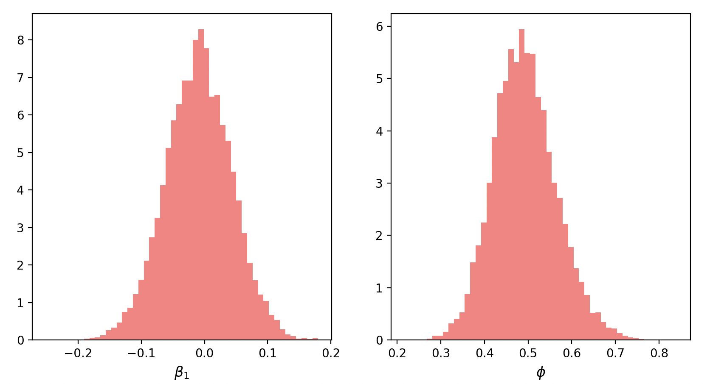
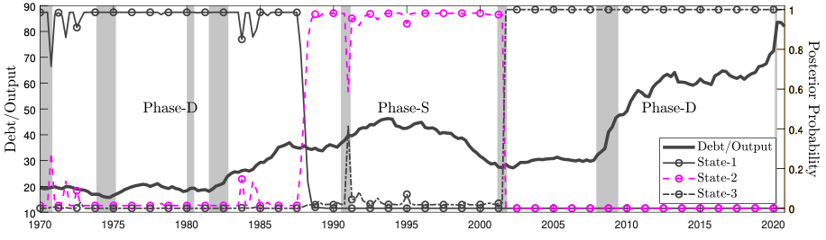

# Lecture 8: Time Series

**Instructor:** Fei Tan

 @econdojo &nbsp;&nbsp;&nbsp;&nbsp;  @BusinessSchool101 &nbsp;&nbsp;&nbsp;&nbsp;  Saint Louis University

**Course:** Introduction to Bayesian Statistics  
**Date:** January 31, 2026

---

## State Space Representation

**Gaussian linear model + Kalman filter**

<div class="equation-box">

$$\begin{align*}
\text{Measurement:}\quad y_t &= D+Z\epsilon_t+v_t,\quad v_t\sim\mathcal{N}(0,\Sigma_v) \\
\text{Transition:}\quad \epsilon_t &= C+G\epsilon_{t-1}+u_t,\quad u_t\sim\mathcal{N}(0,\Sigma_u)
\end{align*}$$

</div>

1. forecast $\epsilon_t$ via transition: $\epsilon_t|y_{1:t-1}\sim\mathcal{N}(\epsilon_{t|t-1},P_{t|t-1})$

   $$\begin{align*}
   \epsilon_{t|t-1} &= C+G\epsilon_{t-1|t-1}\\
   P_{t|t-1} &= GP_{t-1|t-1}G'+\Sigma_u
   \end{align*}$$

2. forecast $y_t$ via measurement: $y_t|y_{1:t-1}\sim\mathcal{N}(y_{t|t-1},F_{t|t-1})$

   $$\begin{align*}
   y_{t|t-1}&=D+Z\epsilon_{t|t-1}\\
   F_{t|t-1}&=ZP_{t|t-1}Z'+\Sigma_v
   \end{align*}$$

3. filter $\epsilon_t$ via Bayes theorem: $\epsilon_t|y_{1:t}\sim\mathcal{N}(\epsilon_{t|t},P_{t|t})$

   $$\begin{align*}
   \epsilon_{t|t}&=\epsilon_{t|t-1}+P_{t|t-1}Z'F_{t|t-1}^{-1}(y_t-y_{t|t-1})\\
   P_{t|t}&=P_{t|t-1}-P_{t|t-1}Z'F_{t|t-1}^{-1}ZP_{t|t-1}
   \end{align*}$$

---

## The Road Ahead

1. [Autoregressive Model](#autoregressive-ar-model)
2. [Regime-Switching Model](#regime-switching-model)

---

## Autoregressive (AR) Model

**Chib's (1993) regression with AR$(p)$ error**

<div class="equation-box">

$$\begin{align*}
y_t &= x_t'\beta+\epsilon_t,\quad t=1,\ldots,T \\
\phi(L)\epsilon_t &= u_t, \quad\phi(L)=1-\phi_1L-\cdots-\phi_pL^p,\quad L\epsilon_t=\epsilon_{t-1}
\end{align*}$$

</div>

- Likelihood function under $u_t\sim_{i.i.d.}\mathcal{N}(0,\sigma^2)$

  $$f(y_{p+1:T}|y_{1:p},\beta,\sigma^2,\phi)\propto \sigma^{-(n-p)}\exp\left[-\frac{1}{2\sigma^2}\sum_{t=p+1}^T(y_t-y_{t|t-1})^2\right]$$

  where $y_{t|t-1}=(1-\phi(L))y_t+\phi(L)x_t'\beta$

- Joint prior (stationarity: $\Phi_s=\{\phi:\phi(z)\neq 0,\ \forall |z|<1\}$)

  $$\pi(\beta,\sigma^2,\phi)=\underbrace{\mathcal{N}(\beta_0,\sigma^2B_0)}_{\pi(\beta|\sigma^2)}\underbrace{\mathcal{IG}\text{-}2(\nu_0/2,\delta_0/2)}_{\pi(\sigma^2)}\underbrace{\mathcal{N}(\phi_0,\Phi_0)1\{\phi\in \Phi_s\}}_{\pi(\phi)}$$

---

## Gibbs Algorithm

- Gibbs sampler for $\pi(\beta,\sigma^2,\phi|y)$

  $$\begin{align*}
  \beta|y,\sigma^2,\phi &\sim \mathcal{N}(\beta_1,\sigma^2B_1) \\
  \sigma^2|y,\beta,\phi &\sim \mathcal{IG}\text{-}2(\nu_1/2,\delta_1/2) \\
  \phi|y,\beta,\sigma^2 &\sim \mathcal{N}(\phi_1,\Phi_1)1\{\phi\in\Phi_s\}
  \end{align*}$$

  where

  $$\begin{align*}
  B_1&=({X^*}'X^*+B_0^{-1})^{-1},\quad x_t^*=\phi(L)x_t \\
  \beta_1 &= B_1({X^*}'y^*+B_0^{-1}\beta_0),\quad y_t^*=\phi(L)y_t \\
  \nu_1 &= \nu_0+k+T-p,\quad k=\text{dim}(x_t) \\
  \delta_1 &= \delta_0+(\beta-\beta_0)'B_0^{-1}(\beta-\beta_0)+(y^*-{X^*}\beta)'(y^*-{X^*}\beta) \\
  \Phi_1 &= (\sigma^{-2}E'E+\Phi_0^{-1})^{-1},\quad \epsilon=E\phi+u \text{ (known given } y,\beta,\sigma^2) \\
  \phi_1 &= \Phi_1(\sigma^{-2}E'\epsilon+\Phi_0^{-1}\phi_0)
  \end{align*}$$

- Extension to ARMA$(p,q)$ error [Chib & Greenberg (1994)]

---

## Python Code

<div class="code-box">

```python
def ar_err(y, x, s, b0, B0, nu0, d0, p0, P0):
    for i in range(1, s):
        # Sample beta
        y2 = filter(y, s['phi'][i - 1, :])
        x2 = filter(x, s['phi'][i - 1, :])
        ...
        s['beta'][i, :] = multivariate_normal.rvs(size=1, mean=b1, cov=B1)
        # Sample sig2
        ...
        s['sig2'][i] = invgamma.rvs(nu1 / 2, size=1, scale=d1 / 2)
        # Sample phi
        for t in range(T - p):
            for j in range(p):
                E[t, j] = err[t + p - j - 1]
        ...
        s['phi'][i, :] = multivariate_normal.rvs(size=1, mean=p1, cov=P1)
    return s
```

</div>

---

## Application: Phillips Curve



- $\Delta\pi_{t}=\beta_0+\beta_1u_{t}+\epsilon_{t}$, $\epsilon_t=\phi\epsilon_{t-1}+u_t$, 2000--2022 monthly
- $\beta_0,\beta_1\sim\mathcal{N}(0,\sigma^2)$, $\sigma^2\sim\mathcal{IG}\text{-}2(\frac{5}{2},\frac{5}{2})$, $\phi\sim\mathcal{N}(0.5,0.15)$
- Phillips curve has flattened considerably since 2000

---

## Regime-Switching Model

**Chib's (1996) Markov mixture model**

<div class="equation-box">

$$\begin{align*}
f(y_t|y_{1:t-1},s_{t-1},\theta) &= \sum_{k=1}^mf(y_t|y_{1:t-1},\theta_k)p(s_t=k|s_{t-1}) \\
p(s_t=j|s_{t-1}=i) &= p_{ij},\quad s_t\in\{1,\ldots,m\},\quad t=1,\ldots,T
\end{align*}$$

</div>

- Chib's (1998) change-point model

  $$P=
  \begin{bmatrix}
  p_{11} & 1-p_{11} & 0 & \cdots & 0 & 0\\
  0 & p_{22} & 1-p_{22} & \cdots & 0 & 0 \\
  \vdots & \vdots & \vdots & \ddots & \vdots & \vdots \\
  0 & 0 & 0 & \cdots & p_{mm} & 1-p_{mm} \\
  0 & 0 & 0 & \cdots & 0 & 1
  \end{bmatrix}$$

- Which specification is more general?

---

## Gibbs Algorithm

- Sample $s_{1:T}$ in one block

  $$\begin{align*}
  p(s_{1:T}|y_{1:T}) &= p(s_T|y_{1:T})\cdots {\color{red}p(s_t|y_{1:T},s_{t+1:T})}\cdots p(s_1|y_{1:T},s_{2:T}) \\
  {\color{red}p(s_t|y_{1:T},s_{t+1:T})} &\propto {\color{blue}p(s_t|y_{1:t})}p(s_{t+1}|s_t),\quad\text{where for } t=1,\ldots,T
  \end{align*}$$

  - prediction step: for $j=1,\ldots,m$

    $$p(s_t=j|y_{1:t-1})=\sum_{k=1}^mp(s_t=j|s_{t-1}=k)p(s_{t-1}=k|y_{1:t-1})$$

  - update step: for $j=1,\ldots,m$

    $${\color{blue}p(s_t|y_{1:t})}\propto p(s_t=j|y_{1:t-1})f(y_t|y_{1:t-1},\theta_j)$$

- Sample each row of $P$ from Dirichlet distribution

  $$p_i\sim\mathcal{D}(\alpha_{i1},\ldots,\alpha_{im})\quad\Rightarrow\quad p_i|s_{1:T}\sim\mathcal{D}(\alpha_{i1}+n_{i1},\ldots,\alpha_{im}+n_{im})$$

  where $n_{ij}$ = # of one-step transitions $i\rightarrow j$ in $s_{1:T}$

---

## Application: Debt Cycles



- $y_t=\Phi_{0,s_t}+\Phi_{1,s_t}y_{t-1}+\Phi_{2,s_t}y_{t-2}+u_t$, $u_t\sim\mathcal{N}(0,\Sigma_{s_t})$,

  $$P=
  \begin{bmatrix}
  p_{11} & 1-p_{11} & 0 \\
  0 & p_{22} & 1-p_{22} \\
  0 & 0 & 1
  \end{bmatrix}$$

- 1970--2020 quarterly data: GDP growth rate, inflation rate, nominal interest rate, surplus-debt ratio, credit spread
- Tan (2022), "Appetite for Treasuries, Debt Cycles, and Fiscal Inflation"

---

## Readings

- Chib (1993), "Bayes Regression with Autoregressive Errors: A Gibbs Sampling Approach," *Journal of Econometrics*

- Chib & Greenberg (1994), "Bayes Inference in Regression Models with ARMA$(p,q)$ Erros," *Journal of Econometrics*

- Chib (1996), "Calculating Posterior Distributions and Modal Estimates in Markov Mixture Models," *Journal of Econometrics*

- Chib (1998), "Estimation and Comparison of Multiple Change-Point Models," *Journal of Econometrics*
