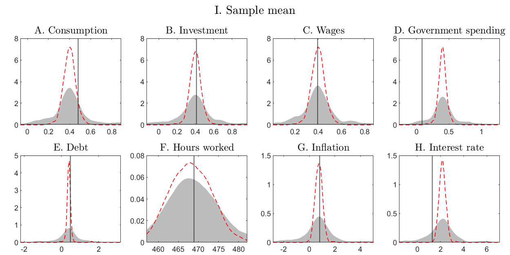
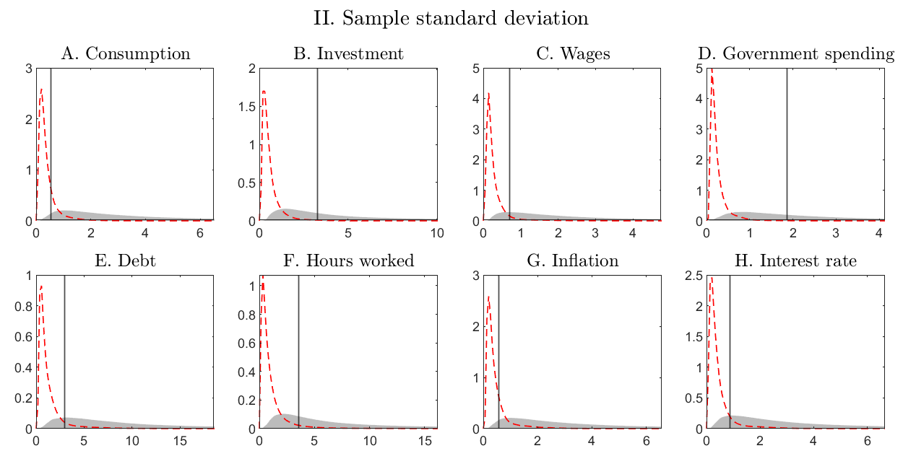
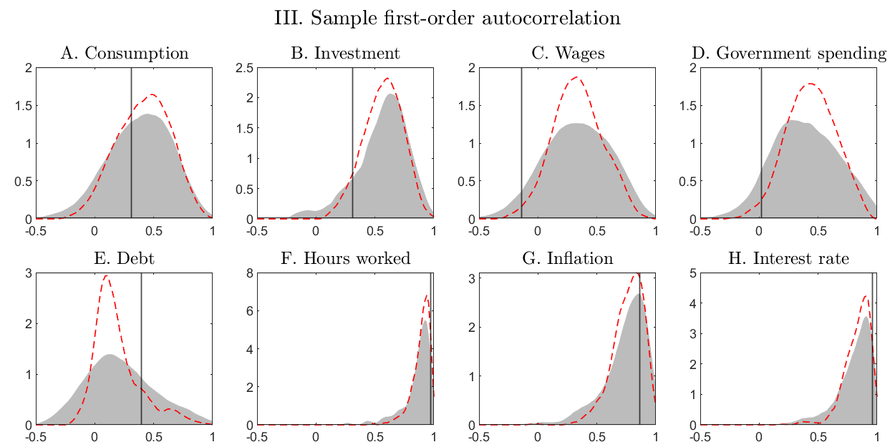
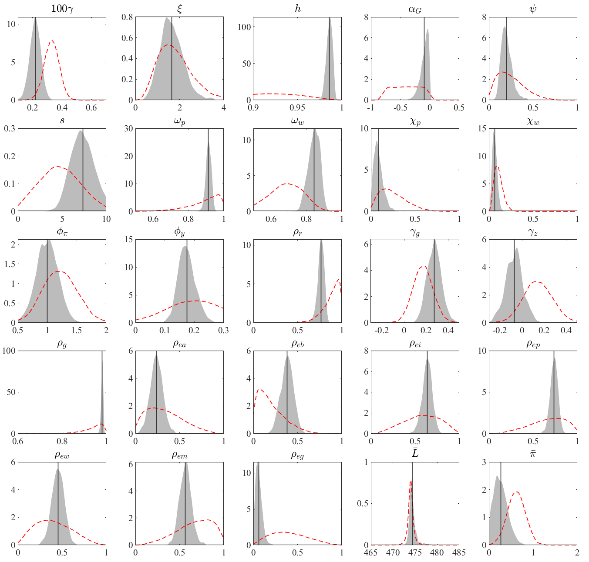
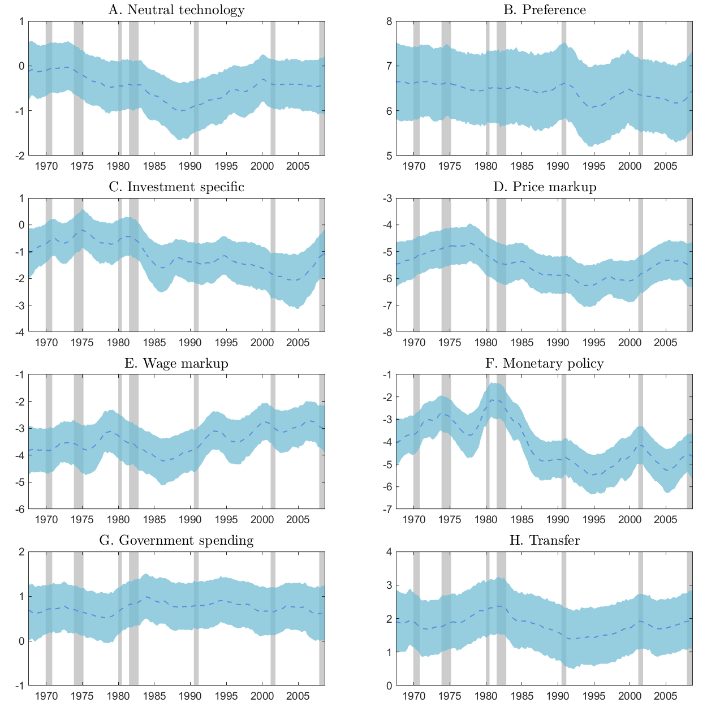
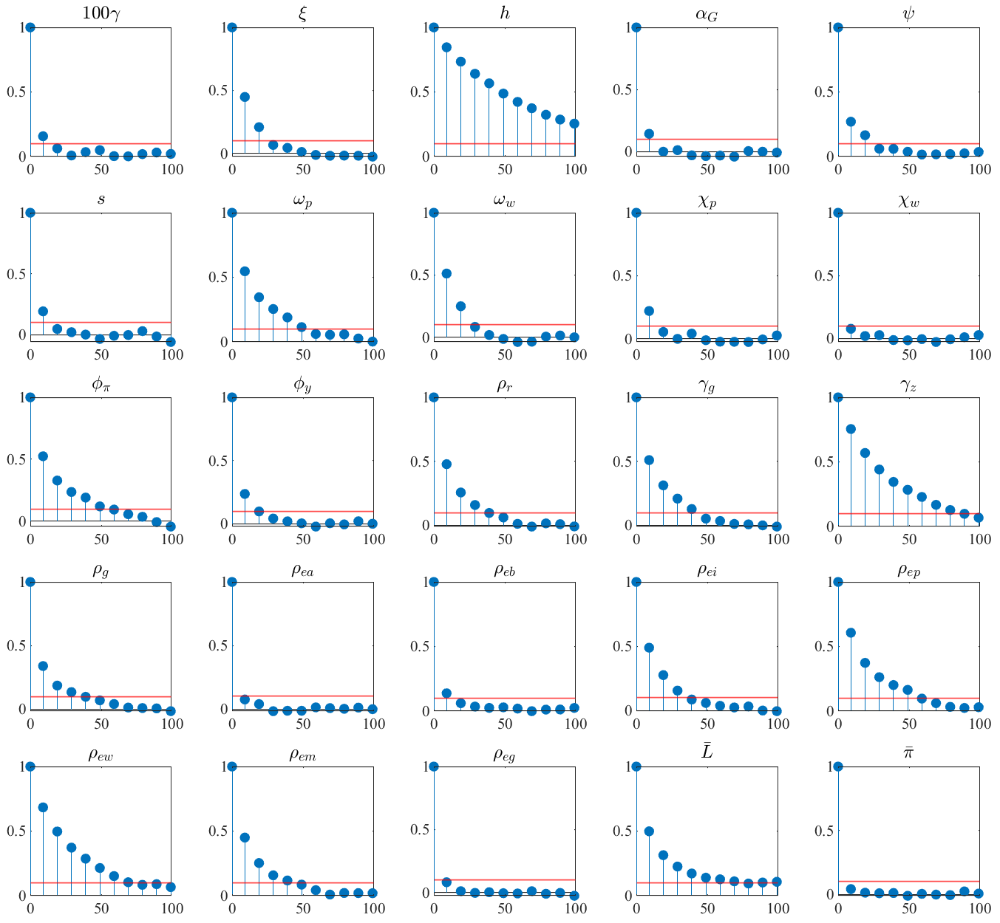
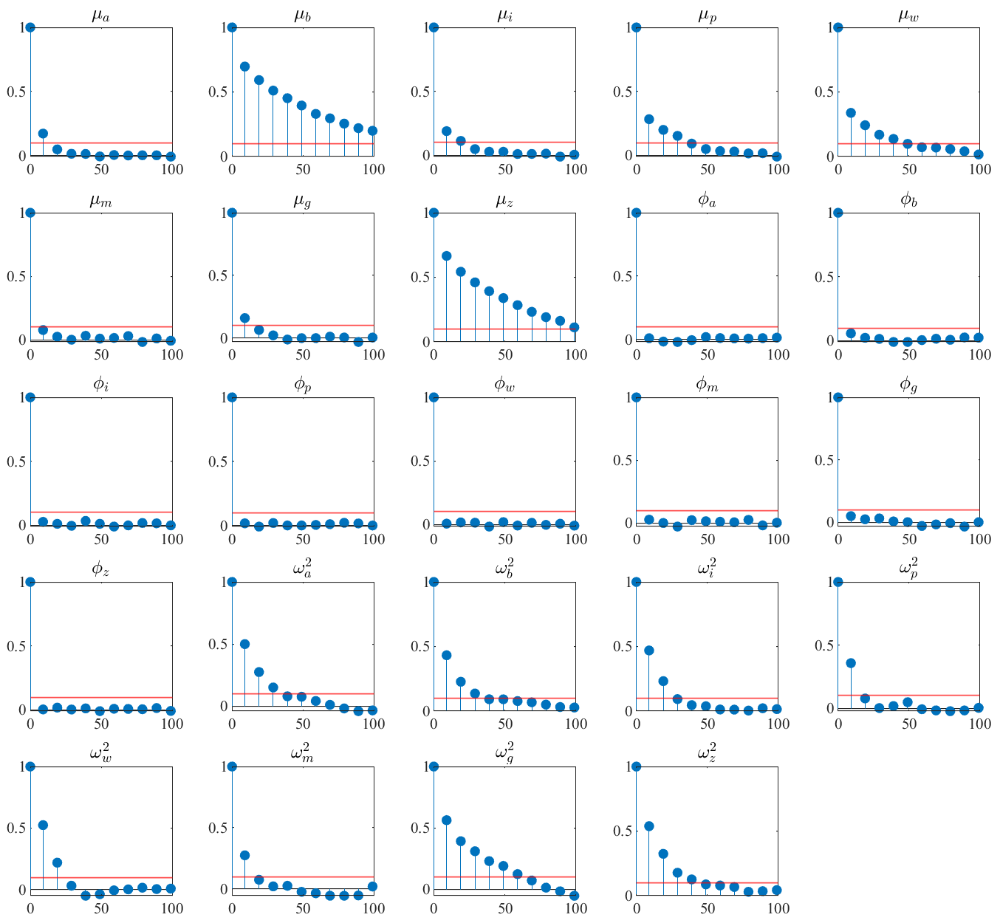
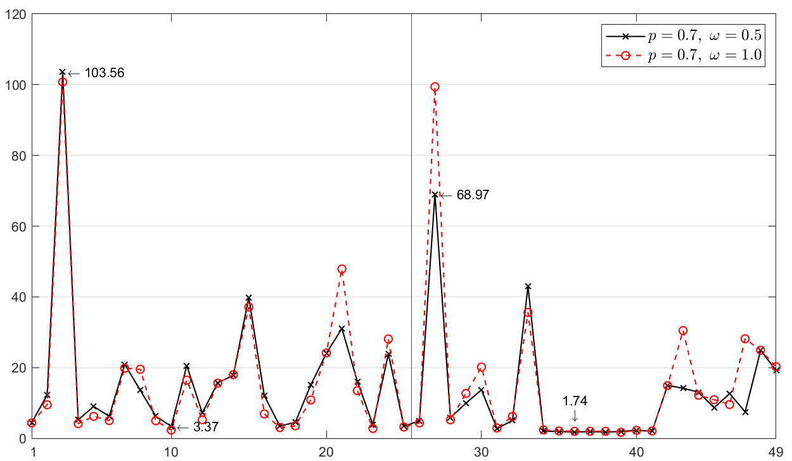
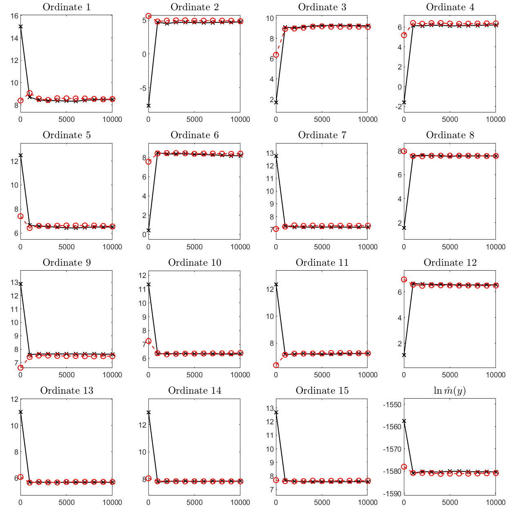

# Lecture 9: Bayesian DSGE Models

**Instructor:** Fei Tan

 @econdojo &nbsp;&nbsp;&nbsp;&nbsp;  @BusinessSchool101 &nbsp;&nbsp;&nbsp;&nbsp;  Saint Louis University

**Course:** Introduction to Bayesian Statistics  
**Date:** January 31, 2026

---

## Introduction

- DYNARE has played a large role in fitting DSGE models

- However, it cannot handle *high-dimensional* DSGE models or models with

  - Student-$t$ shocks, e.g., Chib & Ramamurthy (2014)
  - stochastic volatility, e.g., Justiniano & Primiceri (2008)

- Chib, Shin, & Tan (2021) provide a user-friendly MATLAB toolbox for such models that contains

  - training sample priors
  - efficient sampling of parameters by the TaRB-MH algorithm of Chib & Ramamurthy (2010)
  - fast computation of the marginal likelihood by the method of Chib (1995) and Chib & Jeliazkov (2001)
  - post-estimation tools, e.g., point and density forecasts

---

## The Road Ahead

1. [DSGE Model](#illustration)
2. [Prior Distribution](#training-sample-prior)
3. [Posterior Sampling](#estimation)
4. [Marginal Likelihood](#model-comparison)
5. [Prediction](#post-estimation-tools)

---

## Illustration

- Dynamic IS relation

  $$\hat{y}_t=\mathbb{E}_t\hat{y}_{t+1}+\hat{g}_t-\mathbb{E}_t\hat{g}_{t+1}-\frac{1}{\tau}(\hat{R}_t-\mathbb{E}_t\hat{\pi}_{t+1}-\mathbb{E}_t\hat{z}_{t+1})$$

- New Keynesian Phillips curve

  $$\hat{\pi}_t=\beta\mathbb{E}_t\hat{\pi}_{t+1}+\kappa(\hat{y}_t-\hat{g}_t)$$

- Monetary policy rule

  $$\hat{R}_t=\rho_R\hat{R}_{t-1}+(1-\rho_R)\psi_1\hat{\pi}_t+(1-\rho_R)\psi_2(\hat{y}_t-\hat{g}_t)+\epsilon_{R,t}$$

- Exogenous shocks

  $$\hat{g}_t=\rho_G\hat{g}_{t-1}+\epsilon_{G,t},\quad \hat{z}_t=\rho_Z\hat{z}_{t-1}+\epsilon_{Z,t}$$

- $t$-innovation with SV: for $s\in\{R,G,Z\}$

  $$\epsilon_{s,t}\sim t_{\nu}(0,e^{h_{s,t}}),\quad h_{s,t}=(1-\phi_s)\mu_s+\phi_sh_{s,t-1}+\eta_{s,t},\quad\eta_{s,t}\sim N(0,\omega_s^2)$$

---

## State Space Form

- We rely on Sims' (2001) method to solve for the solution of the structural model, for *each* value of $\theta$

- After (log) linearizing around the steady state, the structural model is expressed in canonical form as

  $$\Gamma_0(\theta)x_t=\Gamma_1(\theta)x_{t-1}+\Psi\epsilon_t+\Pi\eta_t$$

- Applying Sims' method, the unique, bounded solution takes the form

  $$x_t=G(\theta)x_{t-1}+M(\theta)\epsilon_t$$

  where $G(\theta)$ and $M(\theta)$ are non-linear unspecified functions of $\theta$ determined by the solve step

---

## State Space Form (Cont'd)

- Model completed by the measurement equations

  $$\begin{pmatrix}
  \text{YGR}_t \\
  \text{INF}_t \\
  \text{INT}_t
  \end{pmatrix}=
  \begin{pmatrix}
  \gamma^{(Q)} \\
  \pi^{(A)} \\
  \pi^{(A)}+r^{(A)}+4\gamma^{(Q)}
  \end{pmatrix}+
  \begin{pmatrix}
  \hat{y}_t-\hat{y}_{t-1}+\hat{z}_t \\
  4\hat{\pi}_t \\
  4\hat{R}_t
  \end{pmatrix}$$

- We show results for an extended version of this model that has 51 parameters, 21 variables, 8 shocks, 8 observables, and 1,494 non-Gaussian and nonlinear latent variables

---

## Example

- Set MATLAB directory to the 'DSGE-SVt' folder
- Specify the model, data, and save directories

<div class="code-box">

```matlab
%% Housekeeping
clear
close all
clc

%% User search path & mex files
modpath = ['user' filesep 'ltw17'];
datpath = ['user' filesep 'ltw17' filesep 'data.txt'];
savepath = ['user' filesep 'ltw17'];
spec = tarb_spec([],'modpath',modpath,'datpath',datpath,'savepath',savepath);

OneFileToMexThemAll
```

</div>

---

## Training Sample Prior

- In high dimensions, formulating an appropriate prior is difficult due to the complex mapping from $\theta$ to $G(\theta)$ and $M(\theta)$

- Standard choices often produce prior-sample conflict

- We supply two ways of dealing with this: training sample priors and Student-$t$ family of distributions for location-type parameters

- A sampling the prior function is available to calculate the implied distribution of the outcomes

<div class="code-box">

```matlab
%% Sampling the prior
npd = 10000;       % number of prior draws
T = 200;           % number of periods
sdof = 5;          % shock degrees of freedom
SamplePrior(npd,T,sdof,savepath)
```

</div>

---

## Prior Predictive Distribution



---

## Prior Predictive Distribution (Cont'd)



---

## Prior Predictive Distribution (Cont'd)



---

## Estimation

- The centerpiece of the estimation procedure is the TaRB-MH algorithm of Chib & Ramamurthy (2010)

- Used to draw samples of $(\theta,z_{1:T})$ from

  $$\pi(\theta,z_{1:T}|y_{1:T})\ \propto\ f(y_{1:T},z_{1:T}|\theta)\cdot\pi(\theta)\cdot\mathbf{1}\{\theta\in\Theta_D\}$$

- TaRB-MH is coded up in DYNARE, but the implementation there is somehow not efficient

---

## TaRB-MH MCMC

- Two hallmarks of TaRB-MH

  - randomize the number and components of blocks
  - tailor the proposal density to the posterior location and curvature, i.e., $q_b(\theta_{b}|y_{1:T},z_{1:T},\theta_{-b})=t_v(\theta_{b}|\hat{\theta}_{b},\hat{V}_{b})$, $b=1,\ldots,B$, using simulated annealing and Chris Sims' `csminwel`

- The toolbox provides a fast implementation of these steps by

  - randomly tailoring proposal every few iterations
  - MEX loop-intensive functions from C/C++ code
  - `csminwel` to get $\hat{V}_b$ as output

- Although intensive it all happens seamlessly

---

## Example

- Set up the TaRB-MH algorithm
- The estimation results are stored in the MATLAB data file `tarb_full.mat`

<div class="code-box">

```matlab
%% TaRB-MH (full run)
p = 0.7;            % blocking probability
w = 0.5;            % tailoring frequency
spec = tarb_spec(spec,'prob',p,'freq',w);

M = 11000;          % number of draws
burn = 1000;        % number of burn-in
tarb_full(M,burn,spec)
```

</div>

---

## Prior-Posterior



---

## Stochastic Volatility



---

## Autocorrelation



---

## Autocorrelation (Cont'd)



---

## Inefficiency Factor



---

## Model Comparison

- Marginal likelihood is computed by a fast implementation of the Chib & Jeliazkov (2001) estimator

- This estimator is based on the identity of Chib (1995)

  $$m(y_{1:T})=\frac{f(y_{1:T}|\theta^*)\pi(\theta^*)}{\pi(\theta^*|y_{1:T})},\quad\forall\theta^*$$

---

## Model Comparison (Cont'd)

- With multiple block sampling, the posterior ordinate is estimated from the decomposition

  $$\pi(\theta^*|y_{1:T})=\pi(\theta_1^*|y_{1:T})\pi(\theta_2^*|y_{1:T},\theta_1^*)\cdots \pi(\theta_B^*|y_{1:T},\theta_1^*,\ldots,\theta_{B-1}^*)$$

  using several reduced TaRB-MH runs

- Key point: all reduced runs can be parallelized for the cost of only one reduced run, regardless of the number of blocks

- This speeds up the calculation enormously

---

## Example

- Set up the TaRB-MH reduced run
- The estimation results are stored in the MATLAB data file `tarb_reduce.mat`

<div class="code-box">

```matlab
%% TaRB-MH (reduced run)
M = 11000;          % number of draws
burn = 1000;        % number of burn-in
B = 7;              % number of blocks
tarb_reduce(M,burn,B,spec)
```

</div>

---

## Marginal Likelihood



---

<!-- _class: simulation-tables -->

## Simulation Evidence

<div style="font-size: 11px; line-height: 1.0;">

- Chib-Jeliazkov estimator

<table style="border: none; border-collapse: collapse; margin: 2px auto; font-size: 10px; line-height: 0.9;">
<tr><td colspan="3" style="text-align: center; border-bottom: 2px solid #000; padding: 0px 6px;"><b>DGP 1: regime-M with ν=15</b></td><td colspan="3" style="text-align: center; border-bottom: 2px solid #000; padding: 0px 6px;"><b>DGP 2: regime-F with φ=0.5</b></td></tr>
<tr><td style="border-bottom: 1px solid #000; padding: 0px 6px;">ν</td><td style="border-bottom: 1px solid #000; padding: 0px 6px;">M</td><td style="border-bottom: 1px solid #000; padding: 0px 6px;">F</td><td style="border-bottom: 1px solid #000; padding: 0px 6px;">φ</td><td style="border-bottom: 1px solid #000; padding: 0px 6px;">M</td><td style="border-bottom: 1px solid #000; padding: 0px 6px;">F</td></tr>
<tr><td style="padding: 0px 6px;">30 (light)</td><td style="padding: 0px 6px;">4</td><td style="padding: 0px 6px;">0</td><td style="padding: 0px 6px;">0.1 (weak)</td><td style="padding: 0px 6px;">0</td><td style="padding: 0px 6px;">9</td></tr>
<tr><td style="padding: 0px 6px;">15 (fat)</td><td style="padding: 0px 6px;">15</td><td style="padding: 0px 6px;">0</td><td style="padding: 0px 6px;">0.5 (moderate)</td><td style="padding: 0px 6px;">0</td><td style="padding: 0px 6px;">10</td></tr>
<tr><td style="border-bottom: 2px solid #000; padding: 0px 6px;">5 (heavy)</td><td style="border-bottom: 2px solid #000; padding: 0px 6px;">1</td><td style="border-bottom: 2px solid #000; padding: 0px 6px;">0</td><td style="border-bottom: 2px solid #000; padding: 0px 6px;">0.9 (strong)</td><td style="border-bottom: 2px solid #000; padding: 0px 6px;">0</td><td style="border-bottom: 2px solid #000; padding: 0px 6px;">1</td></tr>
</table>

- Modified harmonic mean estimator

<table style="border: none; border-collapse: collapse; margin: 2px auto; font-size: 10px; line-height: 0.9;">
<tr><td colspan="3" style="text-align: center; border-bottom: 2px solid #000; padding: 0px 6px;"><b>DGP 1: regime-M with ν=15</b></td><td colspan="3" style="text-align: center; border-bottom: 2px solid #000; padding: 0px 6px;"><b>DGP 2: regime-F with φ=0.5</b></td></tr>
<tr><td style="border-bottom: 1px solid #000; padding: 0px 6px;">ν</td><td style="border-bottom: 1px solid #000; padding: 0px 6px;">M</td><td style="border-bottom: 1px solid #000; padding: 0px 6px;">F</td><td style="border-bottom: 1px solid #000; padding: 0px 6px;">φ</td><td style="border-bottom: 1px solid #000; padding: 0px 6px;">M</td><td style="border-bottom: 1px solid #000; padding: 0px 6px;">F</td></tr>
<tr><td style="padding: 0px 6px;">30 (light)</td><td style="padding: 0px 6px;">0</td><td style="padding: 0px 6px;">0</td><td style="padding: 0px 6px;">0.1 (weak)</td><td style="padding: 0px 6px;">0</td><td style="padding: 0px 6px;">0</td></tr>
<tr><td style="padding: 0px 6px;">15 (fat)</td><td style="padding: 0px 6px;">0</td><td style="padding: 0px 6px;">0</td><td style="padding: 0px 6px;">0.5 (moderate)</td><td style="padding: 0px 6px;">0</td><td style="padding: 0px 6px;">0</td></tr>
<tr><td style="border-bottom: 2px solid #000; padding: 0px 6px;">5 (heavy)</td><td style="border-bottom: 2px solid #000; padding: 0px 6px;">20</td><td style="border-bottom: 2px solid #000; padding: 0px 6px;">0</td><td style="border-bottom: 2px solid #000; padding: 0px 6px;">0.9 (strong)</td><td style="border-bottom: 2px solid #000; padding: 0px 6px;">0</td><td style="border-bottom: 2px solid #000; padding: 0px 6px;">20</td></tr>
</table>

<p style="font-size: 10px; text-align: center; line-height: 1.0;"><b>Notes</b>: Number of picks for each model specification.</p>

</div>

---

## Post-Estimation Tools

- Toolbox includes post-estimation tools, e.g., functions for conducting impulse response, variance decomposition, and prediction

- For instance, suppose we want the one-quarter-ahead prediction density

  $$p(y_{T+1}|y_{1:T}) = \int p(y_{T+1}|y_{1:T},\theta,z_{T+1})\cdot \pi(\theta,z_{T+1}|y_{1:T}) d(\theta,z_{1:T})$$

- This is available through the TaRB-MH specification

<div class="code-box">

```matlab
%% Out-of-sample forecast
head = 50;       % training sample size
tail = 22;       % forecasting sample size
h = 1;           % forecasting horizon
spec = tarb_spec([],'datrange',[head tail],'pred',h);
```

</div>

---

## Out-of-Sample Forecast


---

## Outroduction

- Going beyond DYNARE for Next-Gen DSGE models
- Efficient and fast estimation via TaRB-MH and parallel computing
- MATLAB toolbox: publicly available at [github.com/econdojo/dsge-svt](https://github.com/econdojo/dsge-svt)
- Readily applied. Current application in progress, an open economy DSGE model that is about twice as big as the largest DSGE model estimated to date

---

## References

- Chib & Ramamurthy (2010), "Tailored Randomized Block MCMC Methods with Application to DSGE Models," *Journal of Econometrics*

- Chib, Shin, & Tan (2021), "DSGE-SVt: An Econometric Toolkit for High-Dimensional DSGE Models with SV and $t$ Errors," *Computational Economics*

- Sims (2001), "Solving Linear Rational Expectations Models," *Computational Economics*
